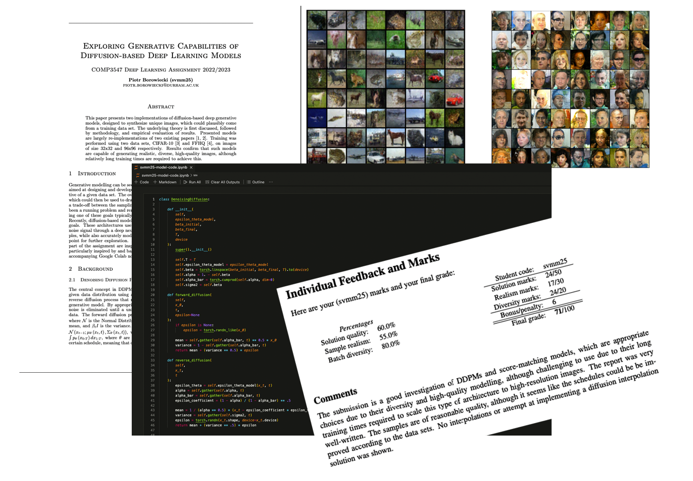
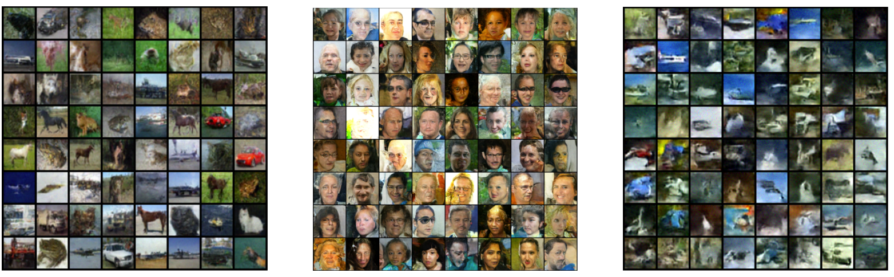

  <h1 align="center">Exploring Generative Capabilities of Diffusion-Based Deep Learning Models</h1>
  <h3 align="center">COMP3547 Deep Learning Assignment 2022/2023</h3>
  

    <a href="https://github.com/pjborowiecki/COMP3547-Deep-Learning.git/issues">Report Bug</a>
    ·
    <a href="https://github.com/pjborowiecki/COMP3547-Deep-Learning.git/issues">Request Feature</a>
  

<!-- TABLE OF CONTENTS -->

  
Table of Contents

  <ol>
    <li>
      <a href="#about-the-project">About The Project</a>
    </li>
    <li>
    <a href="#feedback-received">Feedback Received</a>
    </li>
    <li><a href="#contributing">Contributing</a></li>
    <li><a href="#license">License</a></li>
    <li><a href="#contact">Contact</a></li>
  </ol>

<!-- ABOUT THE PROJECT -->

## About The Project

This repository contains my final submission for the **COMP3547 Deep Learning** module assignment at Durham University in the academic year 2022/2023. Generative modelling is arguably one of the most popular applications of deep learning in recent times. Two implementations of diffusion-based deep generative models, designed to synthesize unique images, which could plausibly come from a training data set are included, along with a report detailing the results of training and evaluation.

Implementation details are thoroughly described in the report, which I encourage you to read to fully understand the problem. The underlying theory is first discussed, followed by methodology, and empirical evaluation of results. Presented models are largely re-implementations of two existing papers: [Denoising Diffusion Probabilistic Models (Ho, Jain, Abbeel)](https://arxiv.org/abs/2006.11239), and [Score-Based Generative Modelling through Stochastic Differential Equations (Song, Sohl-Dickstein, Kingma, Kumar, Ermon, Poole)](https://arxiv.org/abs/2011.13456). Training was performed using two data sets, [CIFAR-10](https://www.cs.toronto.edu/~kriz/cifar.html) and [FFHQ](https://github.com/NVlabs/ffhq-dataset), on images of size 32x32 and 96x96 respectively. Results confirm that such models are capable of generating realistic, diverse, high-quality images, although relatively long training times are required to achieve this.

The DDPM model was slower to train and to sample from, but produced samples of perceivable higher-quality with less epochs required. Parameter `T` was found to be the most detrimental for sampling speed, with higher values meaning more denoising steps and thus, longer sampling time. Generally, it is still not well-understood how much noise is enough. [Franzese et al.](https://arxiv.org/pdf/2206.05173.pdf) provides an interesting analysis of this topic. In images produced by the DDPM trained on CIFAR-10, shapes and objects were clearly recognisable. The images produced by SMM trained on CIFAR-10 are not as clear, but this is likely due to the relatively short training time. It is believed that with more epochs, results would have been much more impressive. Same was the case with FFHQ data set. Training had to be stopped due to limited time and compute resources, but diffusion-based models have excellent convergence properties, and it is expected that longer training could result in more realistic, higher quality samples. In all cases however, images were truly diverse.

Here are the samples produced by the DDPM after 940 epochs of training on CIFAR-10, samples produced by DDPM after only 18 epochs of training on FFHQ, and samples produced by SSM after 2020 epochs of training on CIFAR-10 respectively.

 
<!-- FEEDBACK RECEIVED -->

## Feedback received

The submission is a good investigation of DDPMs and score-matching models, which are appropriate choices due to their diversity and high-quality modelling, although challenging to use due to their long training times required to scale this type of architecture to high-resolution images. The report was very well-written. The samples are of reasonable quality, although it seems like the schedules could be be improved according to the data sets. No interpolations or attempt at implementing a diffusion interpolation solution was shown.

- Solution marks: **26/50**
- Realsim marks: **19/30**
- Diversity marks: **20/20**
- Bonus points (not using GANs, training on higher resolution images): **6**
   
- **Final grade: 71/100**

 
<!-- CONTRIBUTING -->

## Contributing

Contributions are what make the open source community such an amazing place to learn, inspire, and create. Any contributions you make are **greatly appreciated**.

If you have a suggestion that would make this better, please fork the repo and create a pull request. You can also simply open an issue with the tag "enhancement".
Don't forget to give the project a star! Thanks again!

1. Fork the Project
2. Create your Feature Branch (`git checkout -b feature/AmazingFeature`)
3. Commit your Changes (`git commit -m 'Add some AmazingFeature'`)
4. Push to the Branch (`git push origin feature/AmazingFeature`)
5. Open a Pull Request

(<a href="#readme-top">back to top</a>)

<!-- LICENSE -->

## License

Distributed under the MIT License.

(<a href="#readme-top">back to top</a>)

<!-- CONTACT -->

## Contact

Piotr Borowiecki - [@pjborowiecki](https://www.linkedin.com/in/pjborowiecki/) - hello@pjborowiecki.com

(<a href="#readme-top">back to top</a>)

